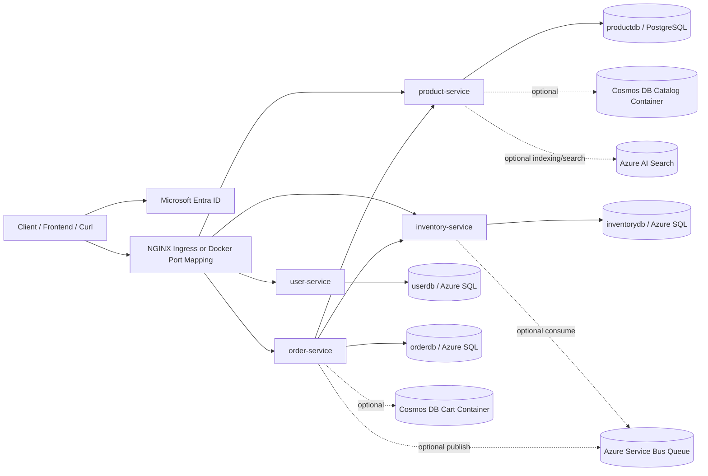
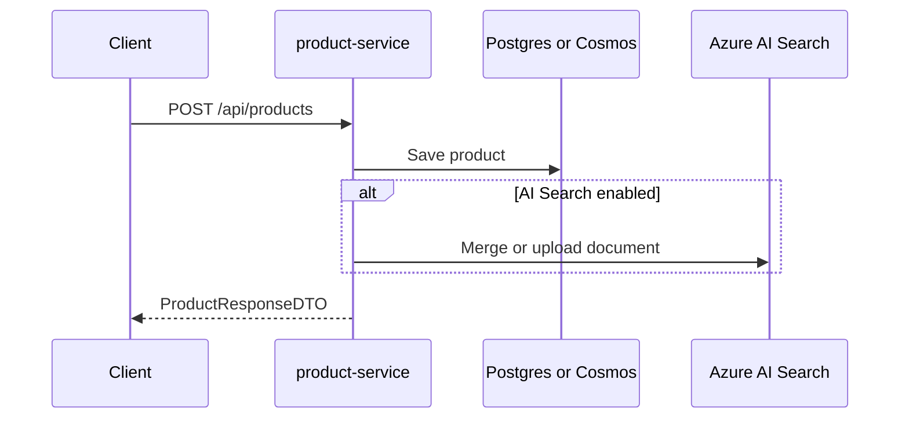
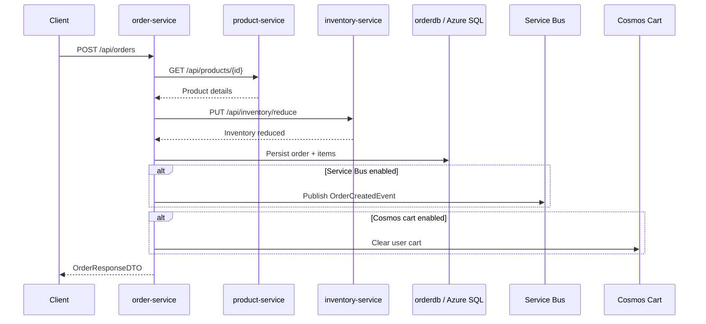

# Cloud Project Architecture

## Overview

This repository implements a Java-based microservices backend for a simple commerce workflow: user registration, product catalog management, inventory management, cart storage, and order placement.

The project is intentionally structured to support two operating modes:

1. A local development mode backed primarily by PostgreSQL and Docker Compose.
2. A cloud-oriented prototype mode on AKS with optional Azure integrations such as Azure SQL, Azure Cosmos DB, Azure Service Bus, Azure AI Search, Microsoft Entra ID, Azure Key Vault, and ACR.

At its core, the system follows a domain-oriented microservice design:

- `user-service` owns user registration and identity inspection APIs.
- `product-service` owns the product catalog and search behavior.
- `inventory-service` owns available stock by product.
- `order-service` owns order placement and acts as the checkout orchestrator.

## Technology Stack

- Java 21
- Spring Boot 4.0.2
- Spring Web MVC
- Spring Security OAuth2 Resource Server
- Spring Data JPA
- PostgreSQL 17
- SQL Server JDBC driver for Azure SQL-backed deployments
- Azure Cosmos DB SDK
- Azure Service Bus SDK
- Azure AI Search SDK
- Docker / Docker Compose
- Kubernetes / AKS
- NGINX Ingress

## System Context



## Repository Layout

```text
.
├── docker-compose.yml
├── init-databases.sql
├── user-service/
├── product-service/
├── inventory-service/
├── order-service/
├── k8s/
│   ├── namespace.yaml
│   ├── postgres.yaml
│   ├── ingress.yaml
│   ├── *-service.yaml
│   └── keyvault/
└── infra/azure/
```

## Service Architecture

| Service             | Port | Responsibility                                                        | Primary APIs                                                                                                                                                                             | Persistence                                                           | Downstream Calls                                                                |
| ------------------- | ---: | --------------------------------------------------------------------- | ---------------------------------------------------------------------------------------------------------------------------------------------------------------------------------------- | --------------------------------------------------------------------- | ------------------------------------------------------------------------------- |
| `user-service`      | 8081 | User registration and current-principal introspection                 | `POST /api/users/register`, `GET /api/users/me`, `GET /api/users/{id}`                                                                                                                   | PostgreSQL locally, Azure SQL in AKS profile                          | None                                                                            |
| `product-service`   | 8082 | Product CRUD and search                                               | `POST /api/products`, `GET /api/products`, `GET /api/products/{id}`, `PUT /api/products/{id}`, `GET /api/products/search?q=...`                                                          | PostgreSQL by default, optional Cosmos DB catalog                     | Optional Azure AI Search                                                        |
| `inventory-service` | 8083 | Inventory CRUD-like write/read operations                             | `POST /api/inventory`, `GET /api/inventory/{productId}`, `PUT /api/inventory/reduce`                                                                                                     | PostgreSQL locally, Azure SQL in AKS profile                          | Optional Service Bus consumer                                                   |
| `order-service`     | 8084 | Order creation, order lookup, cart management, checkout orchestration | `POST /api/orders`, `GET /api/orders/{id}`, `GET /api/orders/user/{userId}`, `POST /api/orders/cart/{userId}/items`, `GET /api/orders/cart/{userId}`, `DELETE /api/orders/cart/{userId}` | PostgreSQL locally, Azure SQL in AKS profile; optional Cosmos DB cart | Calls `product-service` and `inventory-service`; optional Service Bus publisher |

## Domain Ownership

### User Service

`user-service` owns the `users` table and the `User` aggregate. Its business logic is intentionally narrow:

- register a new user
- prevent duplicate emails
- expose authenticated token claims via `/api/users/me`

This service does not participate in checkout orchestration or downstream calls.

### Product Service

`product-service` is the source of truth for catalog data, but the backing store is switchable:

- default path: JPA entity `Product` in the `products` table
- optional Azure path: `CosmosProductDocument` in a Cosmos container partitioned by `/id`

On product create/update, the service also attempts to upsert the document into Azure AI Search when that feature is enabled. Search behavior is also switchable:

- AI Search enabled: query Azure AI Search
- AI Search disabled: perform an in-process filter over the current product list

### Inventory Service

`inventory-service` owns product stock levels in the `inventories` table. It exposes:

- stock creation via `POST /api/inventory`
- lookup by `productId`
- stock reduction via `PUT /api/inventory/reduce`

Although the service can consume `OrderCreatedEvent` messages from Service Bus, the current implementation only logs consumed messages. Inventory reduction for checkout still happens synchronously through the REST API.

### Order Service

`order-service` is the orchestration boundary for checkout. It:

- receives the order request
- fetches product details from `product-service`
- synchronously reduces inventory through `inventory-service`
- calculates total amount
- stores the relational order and order items
- optionally publishes an `OrderCreatedEvent`
- optionally clears the user cart in Cosmos DB

This makes `order-service` the central coordination point of the business flow.

## Runtime Profiles and Feature Flags

Each service uses environment-driven configuration in `application.yaml`.

### Database Profiles

- `postgres`: local/default profile using PostgreSQL
- `azure-sql`: cloud profile used by `user-service`, `inventory-service`, and `order-service` in AKS manifests

### Feature Toggles

The codebase uses four main feature flags:

| Flag                             | Meaning                                                       |
| -------------------------------- | ------------------------------------------------------------- |
| `FEATURE_COSMOS_CATALOG_ENABLED` | Store catalog data in Cosmos DB instead of relational storage |
| `FEATURE_COSMOS_CART_ENABLED`    | Enable Cosmos-backed cart APIs in `order-service`             |
| `FEATURE_SERVICEBUS_ENABLED`     | Enable Service Bus publisher/consumer beans                   |
| `FEATURE_AISEARCH_ENABLED`       | Enable Azure AI Search indexing and query behavior            |

This toggle-based design lets the same services run with different infrastructure combinations without code forks.

## Request and Data Flows

### 1. Authentication and Authorization Flow

All four services are configured as OAuth2 resource servers using Microsoft Entra ID.

Shared model:

- a client obtains a bearer token for a shared backend API audience
- each service validates the JWT issuer and audience
- `GET` endpoints accept `CloudProject.Access`, `CloudProject.Write`, or `CloudProject.Admin`
- mutating endpoints require `CloudProject.Write` or `CloudProject.Admin`
- health and info endpoints stay open for probes

An important implementation detail is that `order-service` forwards the caller's bearer token to downstream services using a `RestTemplate` interceptor. This preserves caller identity and lets downstream authorization still apply.

### 2. Product Catalog Flow



Search flow:

- with AI Search enabled, the service combines semantic, keyword, and fuzzy search strategies and deduplicates results
- with AI Search disabled, the service filters the locally loaded product list by name, description, and category

### 3. Order Checkout Flow



Characteristics of the flow:

- product pricing is pulled at checkout time from `product-service`
- inventory is reduced synchronously before the order response is returned
- the order is persisted after downstream validation succeeds
- Service Bus publishing is best-effort and does not roll back order creation on failure

### 4. Cart Flow

Cart behavior exists only when Cosmos cart is enabled in `order-service`.

Storage model:

- one document per user
- partition key: `/userId`
- items are embedded inside the cart document

Operations:

- add item
- get cart
- clear cart
- clear automatically after successful order creation

## Persistence Architecture

### Local Relational Layout

`docker-compose.yml` starts a single PostgreSQL instance with four logical databases:

- `userdb`
- `productdb`
- `inventorydb`
- `orderdb`

This gives each microservice a separate schema boundary while keeping local development lightweight.

### Relational Entities

| Service             | Entity/Table                                      |
| ------------------- | ------------------------------------------------- |
| `user-service`      | `User` -> `users`                                 |
| `product-service`   | `Product` -> `products`                           |
| `inventory-service` | `Inventory` -> `inventories`                      |
| `order-service`     | `Order` -> `orders`, `OrderItem` -> `order_items` |

### Cosmos DB Usage

Two optional document models exist:

- product catalog documents in `product-service`
- shopping cart documents in `order-service`

Container design:

| Use Case | Container | Partition Key |
| -------- | --------- | ------------- |
| Catalog  | `catalog` | `/id`         |
| Cart     | `cart`    | `/userId`     |

The services create the database and containers on startup if they do not already exist.

### Azure AI Search Index

When enabled, `product-service` creates or updates a search index with these fields:

- `id`
- `name`
- `description`
- `category`
- `price`
- `createdAt`

If semantic search is enabled, the service also adds a semantic configuration prioritizing:

- title: `name`
- content: `description`
- keywords: `category`

## Integration Patterns

### Synchronous Service-to-Service Calls

`order-service` uses REST over internal service URLs:

- `EXTERNAL_PRODUCT_SERVICE_URL`
- `EXTERNAL_INVENTORY_SERVICE_URL`

This is used for:

- product existence and price lookup
- inventory reduction

### Asynchronous Messaging

Azure Service Bus is used as an optional prototype integration:

- producer: `order-service`
- consumer: `inventory-service`
- queue name default: `order-created`

Current behavior:

- `order-service` serializes a simple JSON payload and publishes `OrderCreatedEvent`
- `inventory-service` logs the consumed message
- synchronous checkout still remains the real business path

This means messaging is currently additive for demo/prototype purposes, not a replacement for synchronous coordination.

## Deployment Architecture

### Local Development with Docker Compose

`docker-compose.yml` provisions:

- one PostgreSQL 17 container
- four application containers
- one shared Docker network
- one persisted volume for PostgreSQL

Local runtime defaults:

- all services use the `postgres` profile
- Azure features are disabled
- `order-service` resolves downstream services by Compose service name

### Kubernetes / AKS Deployment

The `k8s/` folder defines:

- namespace creation
- PostgreSQL deployment, PVC, and service
- one deployment and one service per microservice
- NGINX ingress for path-based routing
- secret manifests for Azure-backed configuration
- optional Key Vault CSI integration

Ingress routes:

- `/user/*` -> `user-service`
- `/product/*` -> `product-service`
- `/inventory/*` -> `inventory-service`
- `/order/*` -> `order-service`

The ingress strips the leading service prefix before forwarding traffic.

### Current AKS Infrastructure Shape

Based on the checked-in manifests, the intended AKS mix is:

- `user-service`: Azure SQL profile
- `inventory-service`: Azure SQL profile + Service Bus enabled
- `order-service`: Azure SQL profile + Cosmos cart enabled + Service Bus enabled
- `product-service`: PostgreSQL profile + Cosmos catalog enabled, AI Search secrets wired but feature currently disabled in the manifest

This produces a hybrid architecture where not all services are migrated to the same persistence technology at once.

## Secrets and Configuration Management

Configuration enters the system through environment variables and Kubernetes secrets.

The repo includes secret references for:

- PostgreSQL credentials
- Azure SQL credentials
- Cosmos DB endpoint and keys
- Azure Service Bus connection string and queue name
- Azure AI Search endpoint and API key
- Microsoft Entra ID tenant and audience values

There is also optional integration for Azure Key Vault via the Secrets Store CSI driver and workload identity:

- `k8s/keyvault/secretproviderclass.yaml`
- `k8s/keyvault/workload-identity-serviceaccount.yaml`

This indicates an intended path toward externalized secret management instead of storing runtime secrets only in Kubernetes native secrets.

## Observability and Operations

Each service exposes:

- `/actuator/health`
- `/actuator/info`

These endpoints are used for:

- Docker/Kubernetes health checks
- readiness probes in AKS
- basic diagnostics

Containerization uses a consistent two-stage Docker build:

1. build with Maven and JDK 21
2. run with a smaller JRE 21 image as a non-root user

## Architectural Strengths

- Clear domain boundaries per microservice
- Environment-driven infrastructure switching
- Shared authentication model across all services
- Simple local developer experience
- Incremental Azure adoption without rewriting service APIs
- Path-based ingress that exposes a unified external surface

## Current Tradeoffs and Limitations

- `order-service` is tightly coupled to `product-service` and `inventory-service` during checkout.
- There is no distributed transaction or saga coordination across services.
- Service Bus publishing is best-effort; a publish failure does not fail the order.
- The Service Bus consumer currently logs messages rather than driving business state changes.
- AI Search fallback is a simple in-process filter, not a dedicated query engine.
- There is no dedicated API gateway or service mesh; ingress and service DNS provide the routing layer.
- Centralized tracing, metrics aggregation, and structured logging infrastructure are not part of this repo.
- The system is described in several places as a prototype, so some choices are intentionally pragmatic rather than production-grade.

## End-to-End Architecture Summary

This project is best understood as a microservice prototype that demonstrates a gradual evolution path:

- start with four independently deployable Spring Boot services
- keep local development simple with PostgreSQL and Docker Compose
- introduce cloud services selectively behind toggles
- preserve the same public APIs while swapping backing infrastructure

Functionally, `order-service` is the orchestration center, `product-service` is the catalog boundary, `inventory-service` is the stock boundary, and `user-service` is the identity/user profile boundary. Operationally, the repo supports both a compact local topology and a more distributed AKS-based topology with Azure-native integrations.
